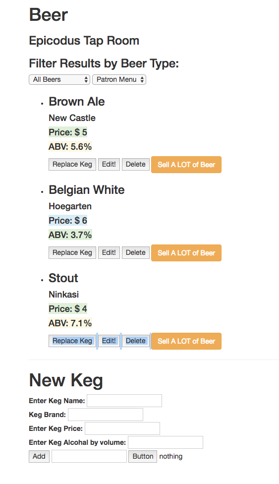

# _Tap Room_

#### _This application allows you to view, edit, delete, and add kegs to a dynamic tap list. Running low? We'll let ya know! Track by ABV, price, etc. ._

#### By _**Aaron Rohrbacher & Nate McGregor**_

## Setup/Installation Requirements

* _Load your favorite terminal window. On a Mac, press `⌘ + ⇧`, type `terminal`, and press Enter._

* _In this terminal window, navigate to the directory in which you wish to save this project. I usually use my desktop (On a Mac) for current projects:_
```
$ cd ~/desktop
```

* _Clone this repository:_
```
$ git clone https://github.com/AaronRohrbacher/taproom
```

* _Navigate to the project's directory:_
```
$ cd taproom
```

* _Install Node.js if you haven't already! If you're on a Mac, I recommend Homebrew https://brew.sh/ for installation. If you're not on a Mac, or are unfamiliar with a command line, visit [NodeJs](https://nodejs.org) for installation instructions. The Node Package Manager (npm) is necessary to run this application. NOTE: Be sure your node version is at least 4.0, and that npm is at least 3.6!_

* _Mac with Homebrew instructions (skip this step if you already have node.js installed):_
```
$ brew install node
```

* _Now, run (definitely don't skip this step):_
```
$ npm install && bower install && gulp build && gulp serve
```

* _You should be seeing a website that looks like the screenshot below! If not, review your installations of Node.js, and Homebrew (if applicable). My apologies for my lack of knowledge beyond MacOS!



## What it will do:

The program will allow you to see a keg list based on if you select employee or patron. Patrons can only see kegs with more than 10 pints left in them, while employees can see all kegs, can change kegs and can see how many pints are left in each keg. Users will also be able to filter list by beer name.

_Aaron Rohrbacher: url(http://aaronrohrbacher.github.io/portfolio/)_

## Technologies Used
_Angular 2, HTML, CSS, JavaScript, jQuery, built and served locally with Bower and Gulp._

Copyright (c) 2017 **_Aaron Rohrbacher Nate McGregor_**
